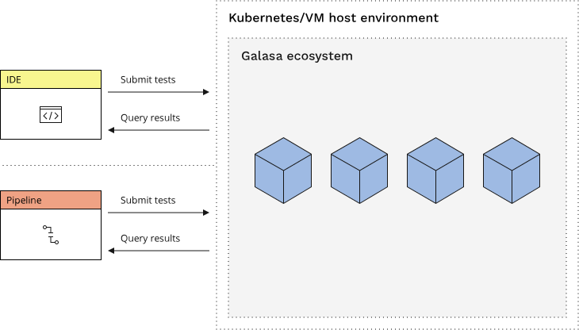

[Ecosystem Architecture](https://galasa.dev/docs/ecosystem/architecture)

### Kubernetes/VM Host Environment:
- Orchestrates microservices for runtime management.
- Monitors tests and resource usage.
- Supports automated resource cleanup.
- Provides a scalable foundation for Galasa services.

### Galasa Ecosystem:
- Centralized repository for run configurations.
- Stores all test results and artifacts.
- Offers a REST endpoint for integration with IDEs and pipelines.
- Powers a unified testing environment for efficient development.

# Stakeholders

## Kubernetes/VM Host Environment:

### Entry Level

- Helps manage and run small parts of software.
- Keeps track of software testing and how much computer power is used.
- Automatically cleans up and frees resources when not needed.
- Can grow or reduce its capacity to support Galasa services as needed.

### Specialist

- Orchestrates microservices, ensuring optimal runtime management and deployment within the system.
- Precisely monitors and logs performance tests, alongside detailed tracking of resource consumption (CPU, memory, etc.).
- Implements automated processes for resource cleanup and reclamation, enhancing system efficiency post-task execution.
- Provides a robust, dynamically scalable infrastructure specifically tailored to accommodate the fluctuating demands of Galasa services.

## Galasa Ecosystem:

### Entry Level
- Stores and manages settings for running software tests.
- Keeps all the results and details from software tests.
- Lets you connect it with coding tools and automated systems.
- Makes testing software easier and more organized.

### Specialist
- Acts as a centralized hub for managing diverse run configurations, enhancing the efficiency of test execution.
- Methodically archives all test results and associated artifacts, ensuring comprehensive data retention and accessibility.
- Provides a REST API endpoint, enabling advanced integration with various Integrated Development Environments (IDEs) and continuous integration/continuous deployment pipelines.
- Facilitates a highly efficient and unified testing environment, crucial for streamlined development processes and quality assurance.
