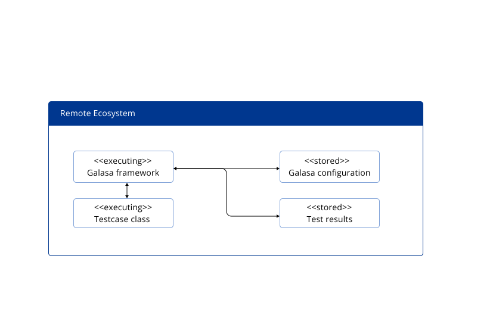

[Running a test in the Galasa Ecosystem](https://galasa.dev/docs/writing-own-tests/running-test-modes)

## General Information
- To run tests remotely within the Galasa Ecosystem, the Galasa bootstrap is configured with the URL of the target ecosystem.
- The ecosystem holds the test configuration and is the environment in which Galasa starts for test execution.
- Tests are submitted remotely by using the "runs submit" Galasa CLI command.
- This approach simplifies remote test execution and result access within the Galasa framework.

## Components

**Galasa Framework (Executing):**
- The Galasa framework plays a central role in the remote execution of tests.
- Tests are submitted to a Galasa Ecosystem for remote execution.
- The framework is responsible for initializing the test environment and executing the test code.
- It operates within a container where the test code runs.

**Testcase Class (Executing):**
- The test case class represents the specific test to be executed remotely.
- It is a critical part of the test execution process within the Galasa Ecosystem.
- Tests are configured within the ecosystem, and the test case class carries out the defined test procedures.

**Galasa Configuration (Stored):**
- Galasa configurations hold the settings and parameters for each test.
- Configurations are stored within the Galasa Ecosystem where the test is executed.
- These configurations define how the test should be conducted and include various parameters and options.

**Test Results (Stored):**
- Test results and artifacts generated during remote test execution are stored in a dedicated database within the Galasa Ecosystem.
- Users on client machines can access and view the test results.
- The stored results provide a comprehensive record of test outcomes and associated artifacts.
