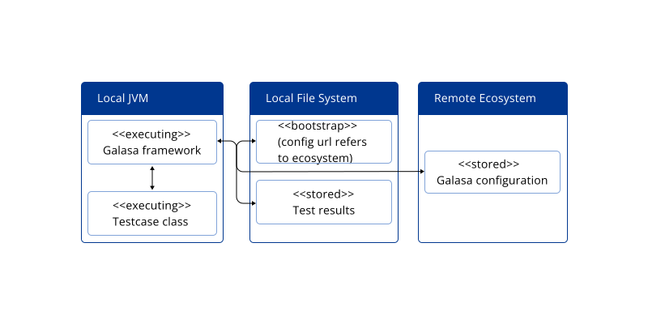

[Running a test locally but using shared configuration](https://galasa.dev/docs/writing-own-tests/running-test-modes)

## Entry Level

### General Information
- To run tests using the same settings as others, you set Galasa to use the same online storage location for these settings.
- Galasa runs on your computer but uses settings from this online storage.
- Passwords and similar private information are taken from a file on your computer.
- This mix of local and shared resources makes it easier to run tests.
- All the results from your tests are kept on your computer.

### Components
**Local JVM (Nested Components - Executing):**
- This is where your computer runs the Java part of Galasa.
- Galasa and your test scripts run here.
- Your tests happen in this Java environment on your computer.

**Local File System (Nested Components - Bootstrap and Stored):**
- Your computer's storage is used for keeping test information.
- A special setup file on your computer, called "Bootstrap," has a link to the shared settings online.
- Results and details of your tests are stored here.
- Your tests use both these local files and the shared settings from online.

**Remote Ecosystem (Stored - Galasa Configuration):**
- An online space stores settings used by everyone running Galasa tests.
- These settings are kept online for everyone to access during tests.
- It has all the necessary settings for the tests.

## Specialist

### General Information
- Running tests locally with shared configurations involves setting the Galasa bootstrap to the URL of the Galasa Ecosystem storing the shared configurations.
- The Galasa Framework operates within the local JVM but retrieves configuration data from the remote ecosystem.
- Credential properties are obtained from a local file during execution.
- This hybrid approach simplifies test execution with local resources while benefiting from shared configurations.
- Test results and artifacts are stored locally.

### Components

**Local JVM (Nested Components - Executing):**
- The Local JVM represents the Java Virtual Machine running locally.
- Within the Local JVM, the "Galasa Framework" and "Testcase Class" execute tests.
- Tests are launched and executed within the local JVM environment.

**Local File System (Nested Components - Bootstrap and Stored):**
- The Local File System serves as a storage and configuration repository for local testing.
- The "Bootstrap" component holds configuration information, with the URL pointing to the remote Galasa Ecosystem where shared configurations are stored.
- The "Test Results" component stores the results of local tests and related artifacts.
- Local test execution leverages shared configurations stored remotely.

**Remote Ecosystem (Stored - Galasa Configuration):**
- The Remote Ecosystem contains the shared configuration for Galasa tests.
- The configuration is held within the ecosystem for easy access during test execution.
- It provides the necessary settings and parameters for tests.
