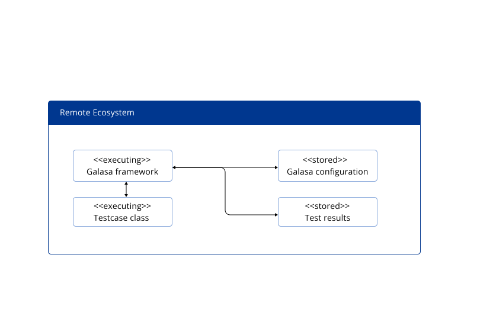
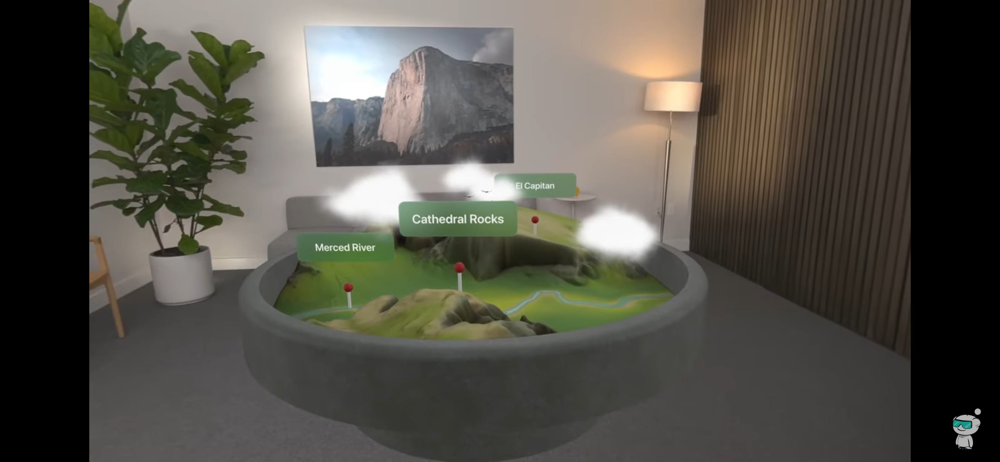
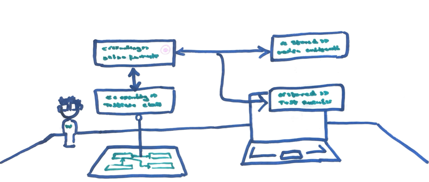
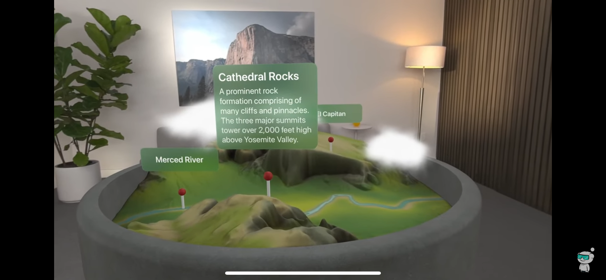
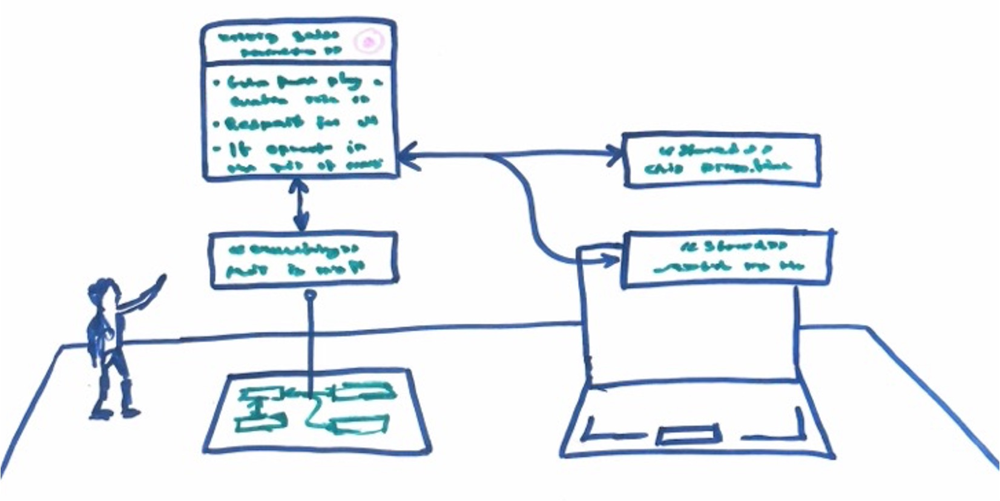

# Design Concepts

This is a preliminary page illustrating the concepts and ideas we were exploring during the initial stages of the project. We will discuss, the ideas we had, what we took to the client and the feedback we recieved to shape the direction we took. You can see how our very first ideas materialised into a mobile application.

## Table of Contents
  - [Initial Concept](#Initial-Concept)
  - [Our MVP](#Our-MVP)

## Initial Concept

### First Ideas

These are the very first ideas we had when thinking about creating the augmented reality experience. We had a lot ideas about what this might look like in theory; we also had to balance this with what was feasable given the scope of the project.

This initial Mockup presented to client was based upon the "Remote Ecosystem Diagram" 

We developed conceptual designs for the augmented diagram and presented these mock-ups to the client for review and feedback.  

Our initial design was inspired by a specific example, which served as a foundational reference.

Using this example as a starting point, we crafted our own unique mockup design.

This design presents a visually engaging and user-friendly interface, enabling users to interact seamlessly with their documentation. In the lower left corner, you'll notice 'Watson,' a virtual assistant designed to aid in understanding the documentation. Watson is envisioned as a 3D figure, skillfully anchored within the 3D space captured by the user's camera, enhancing the overall interactive experience.

### Interacting with the Diagram

When users interact with an element within the augmented reality diagram, it will expand to offer additional, in-depth details about that specific section of the documentation. This interactive feature is designed to enhance understanding by providing context-sensitive information on-demand.

Our  design was mapped by this specific example.

Drawing from this example as our reference, we created an original mock-up design.

Our initial concept sets the stage for development, providing a solid base from which to evolve. Below, you can trace the progression and refinement of our early designs as they undergo our iterative design process.

## Our MVP

### Understanding Augmented Reality

With our initial design concepts now in place and a clear vision of what we aim to create, plus the permission of IBM to build pretty much anything. It was time to start developing.

Our first steps were getting Xcode running on our machines, learning how to develop in swift and then unserstanding how it works instrinsicly with ArKit to create the augmented experience we and most importantly the user would desire.

video

As you can see here, we have successfully integrated the iPhone's camera functionality into our application. This integration allows us to effectively anchor virtual objects, like this block, to the real-world environment captured by the camera. Additionally, we have implemented gesture recognition capabilities. As demonstrated, users can interact with the application by tapping the screen, which triggers the spawning of additional blue blocks in the augmented space.

### Importing Objects

Our next step was being able to import a 3D model into our world; blue blocks won't quite give the user the experince we are aiming for.

Video

This is a video the MVB, if your squint your eyes and look closly you can see the purple globe sat on the desk. This development marks a significant milestone in our project. We have successfully demonstrated the capability to import files in the .usdz format into our application. 

### The Distinct Marker

A critical component of our project involves ensuring that the correct diagram is spawned at the precise moment it is needed. Determining the most effective method for this was challenging. Each diagram requires a distinct marker that the camera can recognize, which then prompts the system to display the appropriate diagram. Following consultations with IBM, we decided that assigning a unique QR code to each diagram would be the most efficient solution. This approach allows for accurate and timely activation of the diagrams within our application.

Video

The accompanying video illustrates our success in spawning an object using a QR code. Crucially, the application also accurately recognizes the spatial plane of the QR code. This allows for the diagram to be projected at a 90-degree angle relative to the plane.

### The Pin

As engaging as purple globes are we needed diagrams which reflected those in the Galasa Documentation. We looked to Blender a 3D creation suite to start to build out our diagrams. After 22 red bulls and several all-nighters we present you this pin...

photo

This next step is crucial, if we can somehow get this pin into our augmented environment, this means we can get almost anything into our mobile application and we'll have this project wrapped up by mid-December. This invloves several pluggins to make sure we exporting this file in correct format.

photo

This is the pin successfully implemented into our augmented environment.

### The Diagram

We looked back to Blender to design diagrams that reflected those found in the Galasa Documentation.

videos

After burning £400 on a 'Welcome to Blender' crash course and guzzling half a dozen double dose adderalls we made our 3D Remote Ecosystem diagrams.

### Our MVP

So... now we spawn objects into our augmented envirronment; we can these objects to spwan in once the camera recongnises a unqiue identifyable and we can create diagrams in blender that we can import into our application. The next step was to put these all together.

Our MVP demonstrates we can spawn in Galasa digarams when promted by the documentation.

video

### Next Steps and the Challenges we Face

* Our application will allow the user to navigate through the diagram to enhance his/her leanring. When navigating this will invlove the augmented picture to update with user gestures. Smoothly transistioning between augmented diagrams is a challange we will need to work through.

* Watson will be an AI assistant that can help the user understand the documentation. We need to impliment watson into the application and importantly align him in such a way that he assists the user.

* We want to develop the application so that it can be used by users with a range of technical abilities. This will mean designing multiple implementations of almost everything.

* The Remote Ecosystem example is an easy one. We need to figure out how we are going to approach more complex diagrams, and convey the information effectivly.

* Getting IBM to sign the dotted line
